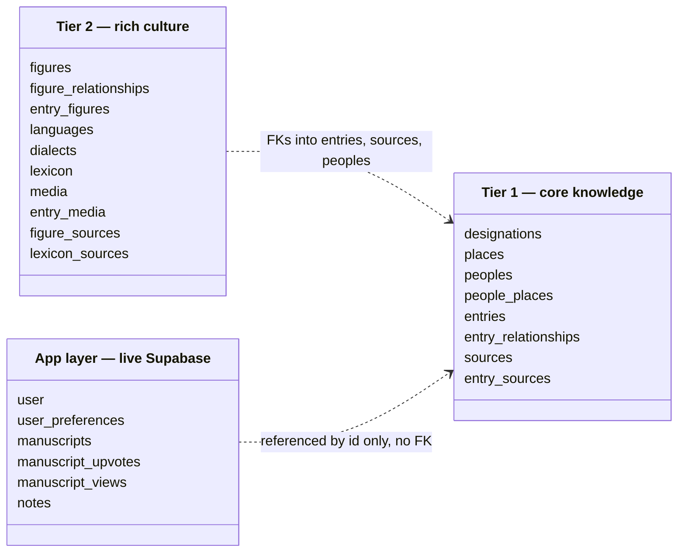

# Structural Model — Overview

Ground truth for these diagrams is the backend SQL, not this folder:

| Layer                     | Source of truth                                 | Tables |
| ------------------------- | ----------------------------------------------- | ------ |
| Tier 1 — core knowledge   | `Backend-Imu-Asusu/SQL/history_model_tier1.sql` | 8      |
| Tier 2 — rich culture     | `Backend-Imu-Asusu/SQL/history_model_tier2.sql` | 10     |
| App layer (live Supabase) | `Backend-Imu-Asusu/supabase/migrations/`        | 6      |

The Tier 1 + Tier 2 files are standalone build scripts for the self-hosted
PostgreSQL database. The app layer is the live Supabase project that the
frontend talks to today. **They are not yet joined** — see
[Known gaps](#known-gaps).

## Diagram index

| #   | Diagram                                                        | Covers                                      |
| --- | -------------------------------------------------------------- | ------------------------------------------- |
| 01  | [Places & Peoples](01-Places-And-Peoples.md)                   | the two recursive trees + designations      |
| 02  | [Entries & the Knowledge Graph](02-Entries-Knowledge-Graph.md) | `entries`, `entry_relationships`            |
| 03  | [Provenance](03-Provenance.md)                                 | `sources` and the three `*_sources` joins   |
| 04  | [Figures](04-Figures.md)                                       | persons, genealogy, succession              |
| 05  | [Language, Lexicon & Media](05-Language-Lexicon-Media.md)      | `languages`, `dialects`, `lexicon`, `media` |
| 06  | [User & Account](06-User-Account.md)                           | `user`, `user_preferences`, `notes`         |
| 07  | [Manuscripts & Collaborate](07-Manuscripts-Collaborate.md)     | authoring, sharing, upvotes, forks, views   |

## Known gaps

Recorded because a reader will otherwise assume these are modelling mistakes.

1. **Two disconnected databases.** Tier 1/2 use `UUID` primary keys and target
   self-hosted PostgreSQL. The live Supabase tables use `bigint` identity keys.
   `notes.context_id` is `text` precisely so it can hold a `peoples.id` UUID
   across that boundary, and `manuscripts.contexts` stores id arrays as JSONB.
   These are cross-database references with no FK enforcement.
2. **`manuscripts` and `user` have no migration in the repo.** They predate the
   `supabase/migrations/` folder and live only in the Supabase project. Columns
   in diagrams 06 and 07 are reconstructed from the migrations that _alter_
   them, so the two tables may carry columns not shown here.
3. **`manuscripts.cultural_history_id`** still points at `cultural_history`, the
   old flat table that Tier 1's `entries` replaces. Live pointer to a dead
   table — a migration target.
4. **`designation_id` cannot enforce `kind`.** A plain FK cannot check that a
   row in `places` references a designation with `kind = 'place'`. Enforced by
   curation today; a composite FK on `(id, kind)` would fix it.
