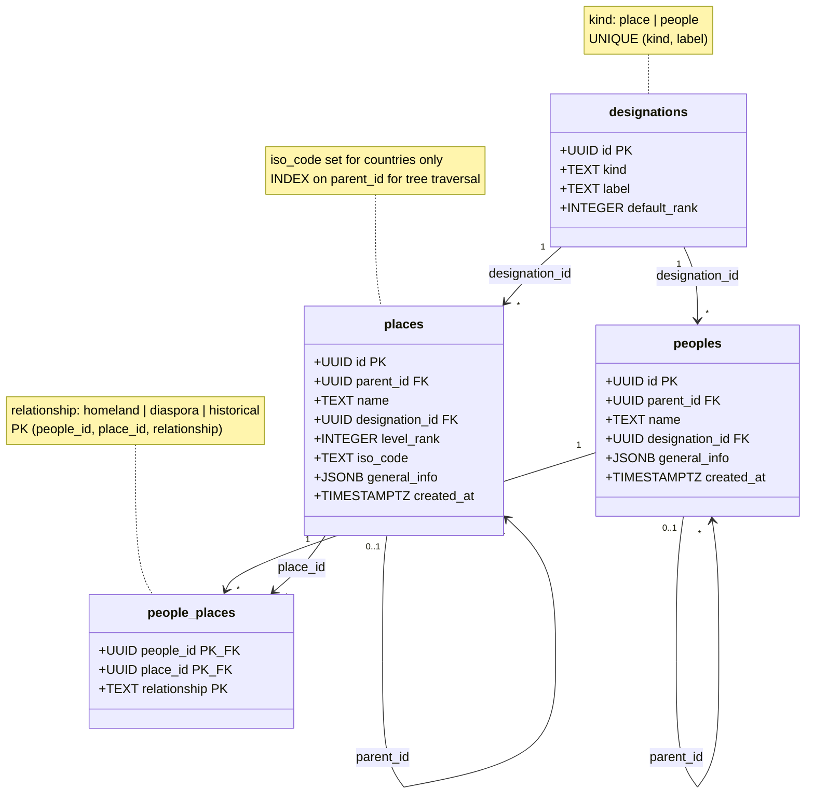

# Places & Peoples

**Source:** `Backend-Imu-Asusu/SQL/history_model_tier1.sql` §1–4



## Description

Two self-nesting trees, deliberately kept apart.

**`places`** is the *where* axis — one tree of arbitrary depth replacing the old
`continents` → `countries` → `states` → `local_governments` chain. The level is
not a table, it is a `designation_id` pointing at a label:

```
Nigeria:  Continent -> Country(Nigeria) -> State(Rivers) -> LGA(Ikwerre) -> Village(Aluu)
France:   Continent -> Country(France)  -> Region -> Departement -> Commune
Kingdom:  --         -> Country          -> Kingdom -> Chiefdom -> Village
```

**`peoples`** is the *who* axis, same shape: Ethnic Group(Ikwerre) → Clan →
Community → Lineage.

**`designations`** is a lookup table rather than an enum — a deliberate line in
the SQL. Vocabularies that vary by country or culture (`Emirate`, `Chiefdom`,
`Age-grade`) are extendable as **data** by a contributor with no migration.
Small, stable, developer-owned vocabularies elsewhere in the model use `CHECK`
constraints instead.

**`people_places`** is why the two trees are not merged. A people rarely maps
1:1 to a place: the Ikwerre span the Ikwerre, Emohua, Obio/Akpor and Diobu LGAs;
a diaspora spans countries. `relationship` records *how* — `homeland`,
`diaspora`, or `historical`. A single merged tree cannot express this; that is
the whole argument for the split.

## Consequences worth knowing

- **Ancestor/descendant lookups need recursive CTEs**, not flat joins. Postgres
  handles this natively, but "all entries for Ikwerre *and its clans*" is a
  `WITH RECURSIVE` query, not a `WHERE people_id = ?`.
- **Level integrity is curation-enforced.** Nothing stops a Country nesting
  under a Village. `level_rank` exists as an optional check hint.
- **`designation_id` cannot enforce `kind`** — a `places` row can reference a
  `kind = 'people'` designation and the database will accept it. See gap 4 in
  the [overview](00-Overview.md#known-gaps).
- **Frontend payoff:** five page hooks (`useStatePage`, `useCountryPage`,
  `useLocalGovernmentPage`, `useEthnicGroupPage`, `useTribePage`) collapse to
  two generic templates driven by `designation`. Breadcrumbs and
  "contains / part-of" navigation fall out of `parent_id`.
