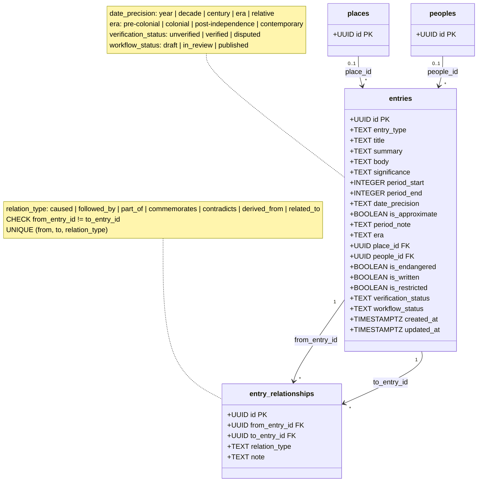

# Entries & the Knowledge Graph

**Source:** `Backend-Imu-Asusu/SQL/history_model_tier1.sql` §5–6

## Description

`entries` is the unit of knowledge — one typed, time-anchored, sourced topic
about a people and/or a place. It replaces the old flat `cultural_history`
table **and** all five `*Presence` classes from the previous diagram set.

### Belonging vs connecting — two different links

This distinction is the reason the model has both FKs and a join table, and it
is the thing most often got wrong when reading it:

- **Belonging** — "assemble all of Ikwerre's history" is a *filter*:
  `WHERE people_id = ?` (plus descendant clans via a recursive CTE) and/or
  `place_id`. This gathers the set. It is **not** a relationship.
- **Connecting** — "how do these entries relate to each other" is
  `entry_relationships`. This makes the set navigable: timeline threads and the
  graph view.

Both `place_id` and `people_id` are nullable and independent. An entry may be
about a place, a people, or both.

### The 30 entry types

`entry_type` is a `CHECK` list, not a lookup table — a deliberate contrast with
`designations`. These are the "best-aspect" lenses onto a culture and they are
developer-owned:

`origin_tradition`, `migration`, `settlement_founding`, `institution`,
`deity_spirit`, `shrine_site`, `cosmology`, `festival`, `rite_of_passage`,
`masquerade`, `proverb`, `folktale`, `praise_name`, `naming_custom`, `craft`,
`architecture`, `attire`, `cuisine`, `music_dance`, `economy`, `agriculture`,
`trade_route`, `marriage_custom`, `kinship`, `event`, `conflict`, `alliance`,
`colonial_encounter`, `modern_identity`, `diaspora`

Notably **absent**: `figure`, `language`, and `lineage`. The 2026-07-19
validation pass removed them — figures and languages are their own entities
(diagrams [04](04-Figures.md) and [05](05-Language-Lexicon-Media.md)), and
Lineage/Clan are `peoples.designation` values, not entry types.

### Honest time

Oral tradition is often only *relatively* datable, so every time column is
nullable and `is_approximate` defaults to **TRUE**. `period_note` carries
relative dating in free text — "≈4 generations before present". The validation
pass added it after finding that `date_precision = 'relative'` had lost its
reference point without one.

### Two status columns, not one

A frequent misreading. They answer different questions:

- `verification_status` — **epistemic**: is this claim trusted? Rolled up from
  what the sources say (see [Provenance](03-Provenance.md)).
- `workflow_status` — **editorial**: where is it in the publishing pipeline?

A claim can be `verified` but still `draft`, or `published` but `disputed`.

### `is_restricted`

Sacred or secret knowledge that is **collected but never publicly displayed**.
It appears on `entries`, `sources`, `media`, and `figures` — every table that
can hold something an informant asked not to be published. Any read path that
serves the public must filter on it.

### `contradicts` is load-bearing

Competing accounts are stored as two entries linked by `contradicts`, with each
side's sources attached — never merged, never silently resolved. This is what
"contested history is modelled, not flattened" means in practice, and it is the
structural reason the Ikwerre–Igbo identity question can be represented at all.
