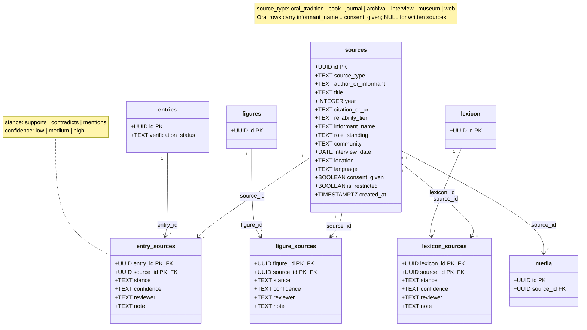

# Provenance

**Source:** `history_model_tier1.sql` §7–8, `history_model_tier2.sql` §9–10

## Description

The reliability backbone, and the part of the model that is genuinely unusual.
The old schema had **no provenance at all** — this is the largest single
addition the history model makes.

Because this history is under-documented in written records, *method matters
more than any single fact*. Nothing enters without a source.

### One shape, four attachment points

`sources` is a single table; four things attach to it via near-identical joins:

| Join | Attaches to |
| --- | --- |
| `entry_sources` | a claim in `entries` |
| `figure_sources` | a person in `figures` |
| `lexicon_sources` | a word in `lexicon` |
| `media.source_id` | direct FK — provenance of the asset itself (photographer, archive) |

The three `*_sources` joins carry an identical column set — `stance`,
`confidence`, `reviewer`, `note` — on purpose. One pattern, one set of API
shapes, one review UI.

### Stance and confidence answer different questions

- `stance` — *what does this source say about the claim?*
  `supports` / `contradicts` / `mentions`
- `confidence` — *how strongly does it back it?* `low` / `medium` / `high`

A source can `contradict` a claim with `high` confidence. Collapsing these into
one score would lose exactly the case the platform exists to handle.

### The rollup

`entries.verification_status` is the aggregate shown in the UI; the join records
what **each** source says. So:

- **`verified`** — independent source *types* agree (a scholarly text *and* an
  elder interview). Agreement between two web pages is not triangulation.
- **`disputed`** — the entry has both `supports` and `contradicts` rows. It is
  a state to display, not a problem to resolve.
- **`unverified`** — the default. Everything starts here.

Note the rollup is **not** computed by a trigger; it is an editorial judgement
written onto `entries`. The join table is the evidence, the column is the
verdict.

### Oral sources carry more

Rows with `source_type` in (`oral_tradition`, `interview`) use seven extra
columns that are `NULL` for written sources: `informant_name`, `role_standing`,
`community`, `interview_date`, `location`, `language`, `consent_given`.

**`consent_given` is an ethical gate, not metadata.** Consent is required before
recording an informant — see `data/collection/interview-guide.md`. Combined with
`is_restricted`, this is how the platform holds knowledge an elder shared but
asked not to be published.

### Why this matters beyond the database

This model is what a trustworthy AI fact-checker grounds against — the
`manuscript-fact-check` edge function has something real to check *against*
only because provenance is first-class. From the spec: *fabricated citations
are worse than none — they poison the reliability the platform exists to
provide.*
