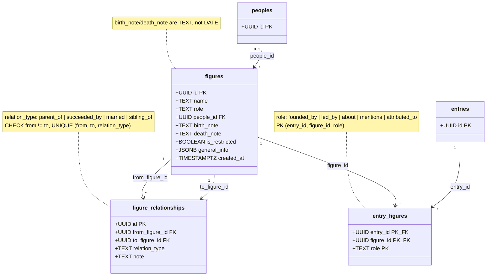

# Figures

**Source:** `Backend-Imu-Asusu/SQL/history_model_tier2.sql` §5–7

## Description

Persons as their own entity — an Eze, a founder, a warrior, a priest.

### Why not an `entry_type`

The original model had `figure` as one of the entry types. The 2026-07-19
validation pass removed it, for two reasons that only show up once you try to
store a real genealogy:

1. **`entries` has no place for a lifespan.** `period_start`/`period_end`
   describe when a *topic* happened, not when a *person* lived.
2. **`entry_relationships` cannot express kinship.** `caused` and `part_of` are
   the wrong vocabulary for `parent_of` and `succeeded_by`, and mixing them
   would make both graphs unqueryable.

### Fuzzy lifespans are the norm

`birth_note` and `death_note` are **TEXT, not DATE** — deliberately. Real values
look like `"~1850"`, `"unknown"`, `"three generations before Akalaka"`. A `DATE`
column would force either a fabricated precision or a `NULL` that discards what
is actually known. This is the same honesty principle as `period_note` on
[entries](02-Entries-Knowledge-Graph.md).

### Three relationship vocabularies, kept separate

This is the cleanest example of the model's typed-joins-over-polymorphism
decision:

| Table | Direction | Vocabulary |
| --- | --- | --- |
| `entry_relationships` | entry → entry | `caused`, `followed_by`, `part_of`, `commemorates`, `contradicts`, `derived_from`, `related_to` |
| `figure_relationships` | figure → figure | `parent_of`, `succeeded_by`, `married`, `sibling_of` |
| `entry_figures` | entry ↔ figure | `founded_by`, `led_by`, `about`, `mentions`, `attributed_to` |

`founded_by` lives in `entry_figures`, **not** `entry_relationships` — a
settlement is founded by a *person*, not by another entry. One polymorphic
relationships table was considered and rejected; each of these three has a
different vocabulary and different FK targets.

### Both `figure_relationships` and `entry_figures` are directional

`from_figure_id → to_figure_id` means the relation reads left to right:
`A --parent_of--> B` says A is the parent. `succeeded_by` likewise. Reciprocal
relations (`married`, `sibling_of`) are still stored one-way; the read path
must query both columns.

### Sourcing

Figures are sourced with the same discipline as entries, via `figure_sources` —
see [Provenance](03-Provenance.md). Clan genealogies in particular exist in
**variants** and must be captured as competing, separately-sourced records
rather than merged into one lineage.

`is_restricted` applies here too: some figures are not for public display.
