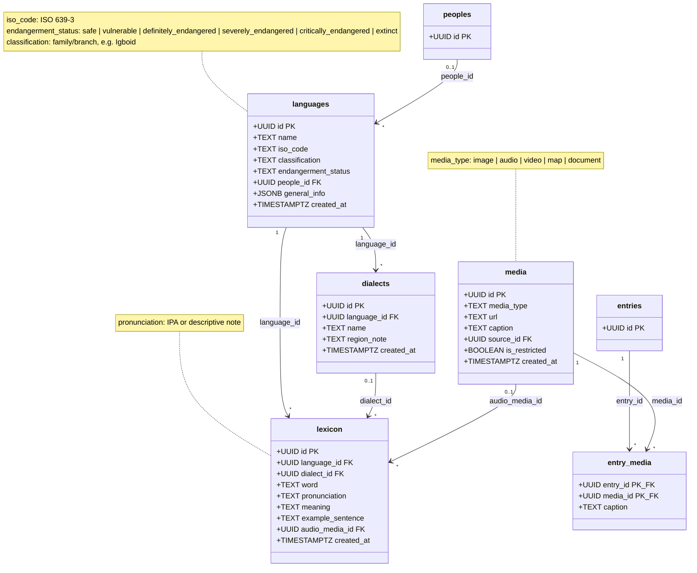

# Language, Lexicon & Media

**Source:** `Backend-Imu-Asusu/SQL/history_model_tier2.sql` §1–4, §8

## Description

### Language as a first-class entity

`languages` was an `entry_type` in the original model and a `text[]` column
before that. Neither survived validation. A language under pressure needs an
ISO code, a family classification, and an endangerment status — none of which
fit in a free-text entry or an array element.

`endangerment_status` follows the **UNESCO scale**, which makes the field
directly comparable against the Atlas of the World's Languages in Danger rather
than being a bespoke vocabulary.

`people_id` is nullable: not every language maps cleanly onto one people, and
the Ikwerre case is exactly why. Its classification within Igboid is *itself a
contested question* bound up with the Ikwerre–Igbo identity dispute — so the
classification lives in a sourced field, not in the table structure.

### Lexicon is the preservation front line

`lexicon` carries `word`, `meaning`, `pronunciation` (IPA or descriptive), and
`example_sentence` — but `audio_media_id` is the column that matters most. A
written form records that a word existed; a recording preserves how it sounded.
For a severely endangered language that difference is the whole point.

`dialect_id` is optional. A word may belong to the language generally or to one
dialect specifically.

### Media, and the build-order dependency

`media` is created **first** in Tier 2, before `lexicon`, because a lexicon row
points at an audio clip. Worth knowing if you re-order the DDL.

Media attaches in two directions:
- **`lexicon.audio_media_id`** — a direct FK, one pronunciation clip per word.
- **`entry_media`** — a join, so an entry can carry many images/videos and one
  asset can illustrate many entries. `entry_media.caption` is per-attachment
  and overrides `media.caption` for that context.

`media.source_id` records provenance of the asset itself — who photographed it,
which archive it came from. See [Provenance](03-Provenance.md).

### `is_restricted` appears here too

Masquerade footage, shrine photographs, and recordings of restricted oral
material are collected but not publicly served. The flag exists on `media`
independently of the entry it is attached to — a public entry can have a
restricted image.

### Sourcing

`lexicon_sources` gives words the same provenance discipline as entries and
figures. `dialects` has no sources join; dialect claims are sourced through the
lexicon rows that exemplify them.
