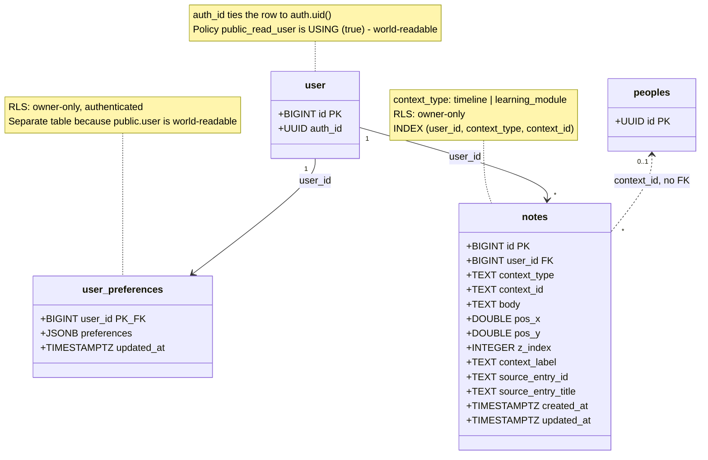

# User & Account

**Source:** `Backend-Imu-Asusu/supabase/migrations/` — `20260724020000_user_preferences.sql`, `20260724000000_create_notes_table.sql`, `20260724010000_add_context_metadata_to_notes.sql`

> ⚠️ `public.user` predates the migrations folder and has no `CREATE TABLE` in
> the repo. The columns below are the ones the migrations and RLS policies
> actually reference; the live table may have more.



## Description

### The `auth_id` indirection

Every RLS policy in the codebase resolves identity the same way:

```sql
user_id = (select id from public.user where auth_id = auth.uid())
```

`auth.uid()` is Supabase's authenticated user (a UUID in `auth.users`);
`public.user.id` is the app's own `bigint`. `auth_id` is the bridge. Any new
table with owner-scoped RLS must follow this pattern.

### Why `user_preferences` is its own table

The migration is explicit, and the reasoning is a security decision rather than
a modelling one: **`public.user` is world-readable** — policy `public_read_user`
is `USING (true)` for both `anon` and `authenticated`. A person's regions of
interest are nobody else's business, so preferences cannot be a column on that
table.

Nothing ever needs to read another user's preferences (Collaborate ranks against
the *reader's own* regions), so owner-only RLS costs nothing.

### One JSONB blob, not a join table

`preferences` holds saved regions + onboarding intent as a single blob rather
than a `user_regions` join, because preferences are always read whole. This
matches `manuscripts.contexts`, which stores id arrays the same way. Normalize
only if we ever need to query *across* users by region.

This is what replaced the old `user_interests` and `learning_progress` tables —
both of which were one row per place with a four-way "exactly one FK is set"
CHECK constraint. See the [overview](00-Overview.md#what-changed-from-the-previous-diagram-set).

Moving preferences from browser storage onto the account is also why a shared
machine can be logged out without leaking the last person's interests into the
next person's session.

### Notes cross the database boundary

`notes.context_id` is **`TEXT`, not `UUID`** — deliberately. A timeline context
is a `peoples.id` (a UUID in the self-hosted history model), while learning
modules don't exist yet and may key differently. There is no foreign key here
and cannot be one: the two tables live in different databases. See gap 1 in the
[overview](00-Overview.md#known-gaps).

`context_label`, `source_entry_id`, and `source_entry_title` were added so the
notes library page can describe where a note came from **without extra joins** —
which, across a database boundary, it could not do anyway. This is denormalization
by necessity, not by choice.

### Position columns are real state

`pos_x`, `pos_y`, and `z_index` persist where a floating note card sits on
screen, so it stays put between sessions. The per-context note cap is enforced
**client-side** as a config constant, deliberately not in the schema, so it can
be raised later without a migration.
