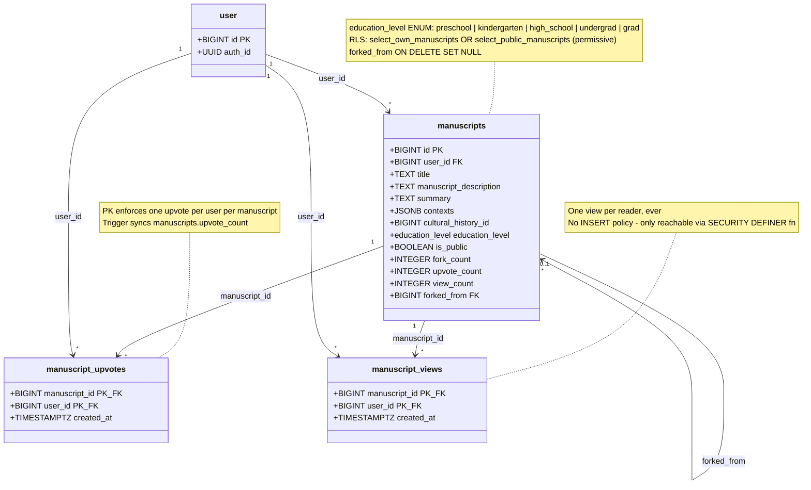
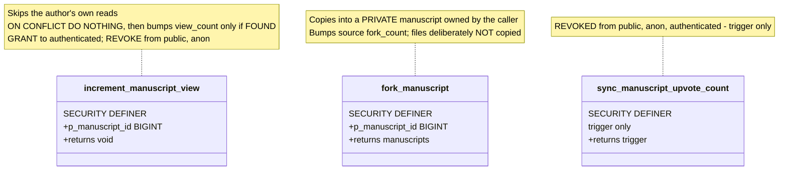

# Manuscripts & Collaborate

**Source:** `Backend-Imu-Asusu/supabase/migrations/` — `20260708000000_restrict_manuscripts_rls_to_owner.sql`, `20260708010000_add_education_level_to_manuscripts.sql`, `20260724000000_collaborate_public_manuscripts.sql`, `20260724010000_collaborate_unique_manuscript_views.sql`

> ⚠️ `public.manuscripts` predates the migrations folder. Columns below are
> those the migrations add or reference; the live table may have more.

## Functions

## Description

### The security shape

This is the one part of the schema where the access rules *are* the design.
Owner-only RLS on `manuscripts` is what keeps everything else safe, so any write
that touches a row the caller does **not** own has to go through a
`SECURITY DEFINER` function:

| Write | Why it can't be a direct write |
| --- | --- |
| `view_count` | the reader doesn't own the manuscript |
| `upvote_count` | same |
| source's `fork_count` | the forker doesn't own the original |

Policies are **permissive**, so `select_public_manuscripts` ORs with
`select_own_manuscripts`: authors keep seeing their private work, everyone
additionally sees what has been shared.

### Views mean readers, not opens

The second Collaborate migration changed the definition, and the reasoning is
worth preserving:

1. **One view per reader**, however often they re-open it.
2. **An author reading their own work is not a reader** — otherwise anyone could
   inflate their standing by opening their own manuscript.

`manuscript_views` has a `SELECT` policy but deliberately **no**
insert/update/delete policy. The only way in is the definer function.

The migration also *re-derived every counter from scratch* rather than leave
numbers recorded under the old "total opens" rule — those had no record of who
did the opening, so distinct readers could not be recovered from them. A number
that means neither thing is worse than a reset.

### Forking

`fork_manuscript` creates a **private** copy owned by the forker
(`is_public => false`), sets `forked_from` to the source, and bumps the source's
`fork_count`. The original is never mutated otherwise. Attached files are
deliberately not copied.

`forked_from` is `ON DELETE SET NULL` — deleting an original orphans its forks
rather than cascading them away.

### Denormalized counters

`upvote_count`, `view_count`, and `fork_count` are denormalized onto
`manuscripts` because Collaborate sorts and ranks on them for every card on the
page. The upvote trigger is what keeps that honest;
`greatest(upvote_count - 1, 0)` guards against drift going negative.

### AI edge functions

Four Deno functions in `supabase/functions/` operate on this table:
`manuscript-generate`, `manuscript-writing-assist`, `manuscript-fact-check`, and
`notes-ai`. `education_level` exists to tailor writing-assist tone to the
intended audience — it is an AI input, not a display field.

`manuscript-fact-check` is the function that should ground against
[Provenance](03-Provenance.md), which is currently impossible across the
database boundary.

### `cultural_history_id` is a live pointer to a dead table

`cultural_history` is the old flat history table that Tier 1's `entries`
replaces. `fork_manuscript` still copies this column. Migrating it to reference
`entries` is outstanding work — gap 3 in the
[overview](00-Overview.md#known-gaps).
